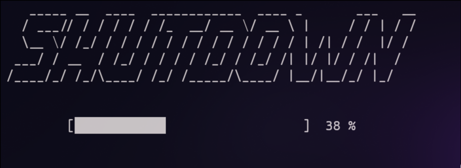

# Custom Shutdown Animation

This project adds a custom animation before executing the shutdown command on your system. When executed, it displays an ASCII animation along with a loading bar, providing a visually appealing shutdown sequence.

## Preview



## Requirements

- **Python**: Tested on Python 3.13.7
- **Dependencies**: No external Python packages are required, only the standard library.
- Compatible with both **Windows** and **POSIX** systems.

## Files

- `custom_shutdown.sh` – Shell script that runs the animation and then executes the shutdown.
- `animations.py` – Python script that handles the ASCII animation and loading bar.
- `cursor_lib.py` – Utility module to hide and show the cursor during the animation.
- `ascii_text.txt` – Text file containing ASCII art to display during the animation.

## Usage

1. Make the shell script executable:

```bash
chmod +x custom_shutdown.sh
```

2. Execute the script:

```bash
./custom_shutdown.sh
```
